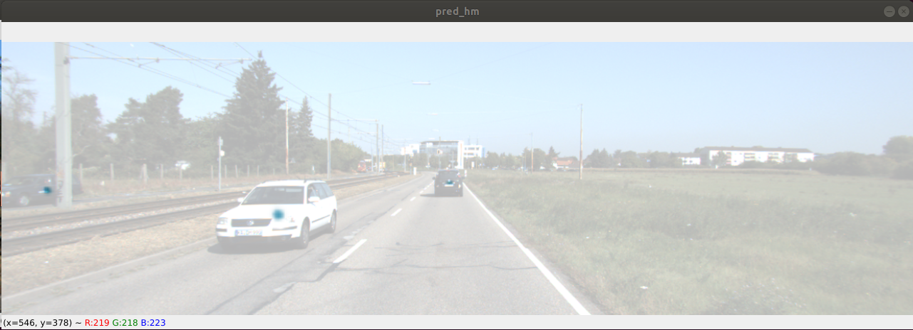
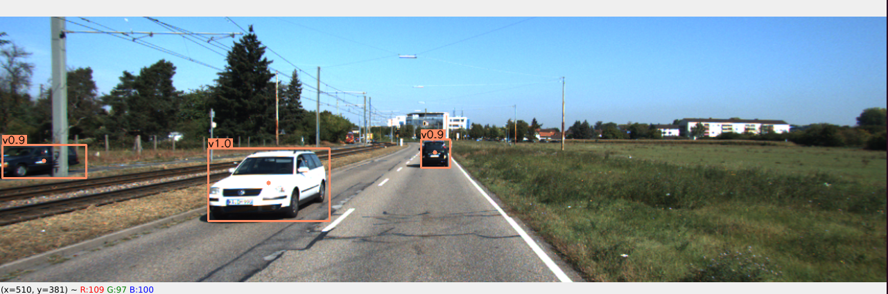
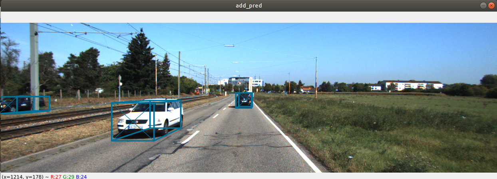
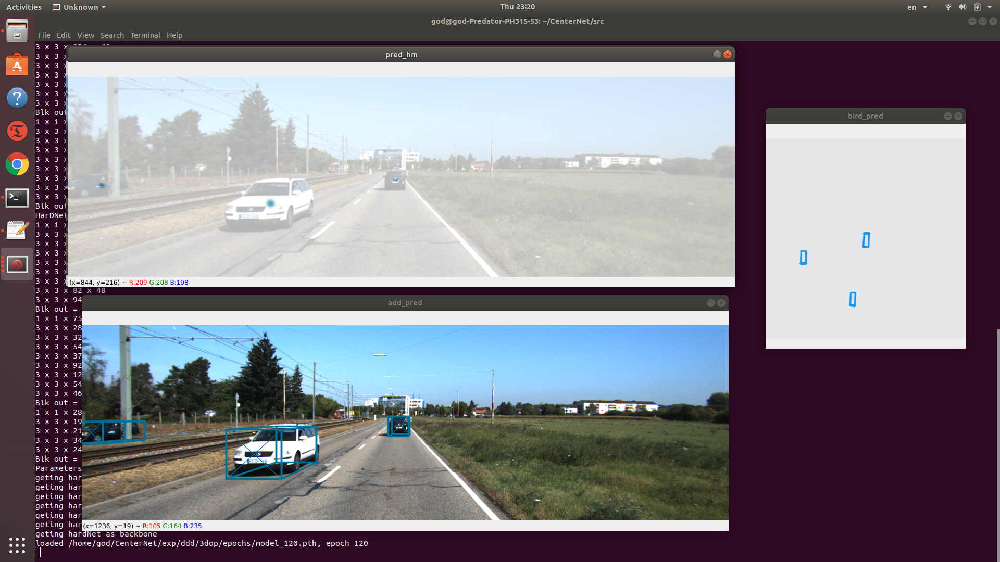

# CenterHarDNet

**This repository is testing the backbone — HarDNet-68 in CenterNet**
The original centerNet repo is https://github.com/xingyizhou/CenterNet.

Thank you for Mr zhou and his team introducuing a new alternative for object detection with a simpler structure and idea.

For the HarDNet, I appreciate PingoLH's work on hardnet. Please also check his repo: https://github.com/PingoLH/Pytorch-HarDNet
**Objects as Points**
https://arxiv.org/abs/1904.07850

**Harmonic DenseNet: A low memory traffic network (ICCV 2019 paper)
**
https://arxiv.org/abs/1909.00948

**To use or play around with this repo, please see these following guidlines**

[installation guidline](https://github.com/yktangac/CenterHarDNet/blob/main/installation/intallation.md)

[data path setup](https://github.com/yktangac/CenterHarDNet/blob/main/installation/DATASET.md)

[Traing and Testing guidline](https://github.com/yktangac/CenterHarDNet/blob/main/installation/traing-and-testing.md)

**Visualization: HeapMap /2D object detection / 3D object detection / BirdView graph**

**HeapMap:**

**2D object detection:**

**3D object detection:**

**BridView:**

